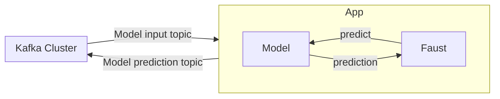
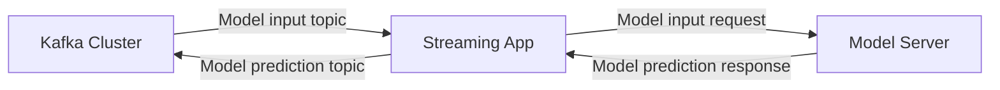

# ml-streaming-app-with-faust

An app that consumes streaming data and executes model inference in real time.
Powered by Faust, Kafka, and Tensorflow.

## Motivation of the project

This project was born as a means to learn more about machine learning systems
for real-time applications. This is becoming an increasingly popular field, especially
in fields such as recommender systems or fraud detection.

## Design considerations

In this architecture design, the machine learning model is embedded into the streaming application.
This has a series of advantages and disadvantages that must be taken into account. There are other designs
worth mentioning, which will be briefly described in the section `Other possible designs`.

I will use Kafka as the real-time data source since it is a mature technology that can handle
millions of events per second. When creating a streaming application with an embedded model, a common
approach is using `Kafka Streams`, which is a library programmed in java. However, I feel comfortable programming in python. So,
I decided to use `Faust`, which is fully in Python and tries to cover the same requirements as `Kafka Streams`.
Finally, for the model inference, I will use `TensorFlow`.

### Other possible designs

The streaming application and the model server could be decoupled, as shown below. This has attractive
advantages, like the fact that you can enjoy many of the features that some model servers offer, such as model
monitorization, versioning, etc. Typically, the model server communicates to other services
via gRPC or REST. This design has some advantages and disadvantages with respect
to the one proposed:

- Disadvantages
  - High latency, given the usage of gRPC or REST.
  - Coupling of the latency, availability and scalability of the streaming app
  with that of the model server.
- Advantages
  - Model servers have features such as A/B testing, monitorization,
  model versioning, etc, which are very important in the MLOps cycle.

Although this is out of the scope of this project, some model servers available
are aware of the latencies and offer communication with Kafka Stream applications
via the native Kafka protocol, which would eliminate the problem of latencies.
This is covered in [3]. Moreover, TensorFlow I/O offers a way to directly connect
to a Kafka Cluster to do inferences or even train a model.

## Making it run

- Deploy the docker-compose and make calls to it: `docker-compose up`.
- Create topic for input tweets: `BROKER_URI="kafka-cluster:9092"; docker exec mlstreamingappwithfaust_kafka-cluster_1 /opt/bitnami/kafka/bin/kafka-topics.sh --create --bootstrap-server $BROKER_URI --replication-factor 1 --partitions 3 --topic incoming_tweet`
- Start a Faust Worker: `docker exec mlstreamingappwithfaust_streaming-app_1 make run-worker`

To test the system:

- `./kafka-console-producer.sh --topic incoming_tweet --bootstrap-server localhost:29092`
- `./kafka-console-consumer.sh --bootstrap-serlocalhost:29092 --from-beginning --topic tweet_disaster_inference`

run-system:
	docker-compose up && \
	docker exec -d mlstreamingappwithfaust_kafka-cluster_1 /opt/bitnami/kafka/bin/kafka-topics.sh --create --bootstrap-server $(BROKER_URI) --replication-factor 1 --partitions 3 --topic incoming_tweet && \
	docker exec -d mlstreamingappwithfaust_streaming-app_1 make run-worker

## References

- [1] https://www.confluent.io/es-es/blog/machine-learning-real-time-analytics-models-in-kafka-applications/
- [2] https://kai-waehner.medium.com/kafka-native-machine-learning-and-model-deployment-c7df7e2a1d19
- [3] https://www.kai-waehner.de/blog/2020/10/27/streaming-machine-learning-kafka-native-model-server-deployment-rpc-embedded-streams/