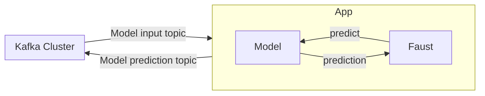
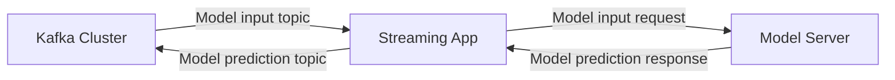

# ml-streaming-app-with-faust

An app that consumes streaming data and executes model inference in real-time.
Powered by Faust, Kafka, and Tensorflow.

## Motivation of the project

This project was born as a means to learn more about machine learning systems
for real-time applications. This is becoming an increasingly popular field, especially
in fields such as recommender systems or fraud detection.

## Design considerations

In this architecture design, the machine learning model is embedded into the streaming application.
This has a series of advantages and disadvantages that must be taken into account. There are other designs
worth mentioning, which will be briefly described in the section `Other possible designs`.

TODO: Create better arguments than this

- Advantages
  - Low latency, given that the prediction is done within the app
  - Less complexity. Having this monolithic system is easier to handle.
- Disadvantages
  - We lose the advantages of model servers, like A/B testing, monitorization,
  model versioning, etc, which are very important in the MLOps cycle.
  - Scalability affects both the model and the streaming application

TODO: Mention the fact that you could use Python API client, for example. (see advantages
and disadvantages).

I will use Kafka as the real-time data source since it is a mature technology that can handle
millions of events per second. When creating a streaming application with an embedded model, a common
approach is using `Kafka Streams`, which is a library programmed in java. However, I feel comfortable programming in python. So,
I decided to use `Faust`, which is fully in python and tries to cover the same requirements as `Kafka Streams`.
Finally, for the model inference, I will use `TensorFlow`.

### Other possible designs

The streaming application and the model server could be decoupled, as shown below. This has attractive
advantages, like the fact that you can enjoy many of the features that some model servers offer, such as model
monitorization, versioning, etc. Typically, the model server communicates to other services
via gRPC or REST. This can introduce undesired latencies.

However, model servers available are aware of this limitation, and some offer
communication with Kafka Stream applications via the native Kafka protocol,
which would reduce the latencies. This is covered in [].

## Useful references

- https://www.confluent.io/es-es/blog/machine-learning-real-time-analytics-models-in-kafka-applications/
- https://kai-waehner.medium.com/kafka-native-machine-learning-and-model-deployment-c7df7e2a1d19

