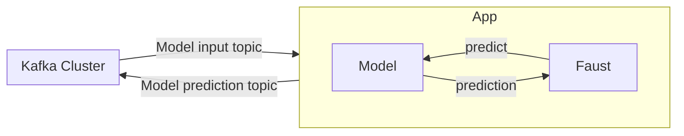
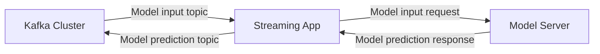

# ml-streaming-app-with-faust

## Introduction

An app that consumes streaming data and executes model inference in real time.
Powered by Faust, Kafka, and Tensorflow.

Concretely, the streaming data used here will be text events that could be obtained
for example from Twitter. The model used on this repository has been obtained following 
[this public notebook's section](https://www.kaggle.com/code/jagdmir/tweet-analysis-ann-bert-cnn-n-gram-cnn#CNN-with-word-Embeddings).
The model is created as part of Kaggle's "Natural Language Processing with Disaster Tweets"
competition and it can distinguish Tweets that mention a natural disaster from those that
do not. This model was chosen because of its simplicity. The inference on
one Tweet should take a fraction of a millisecond. The model is packaged using `bentoml`
and available in this repository.

## Motivation of the project

This project was born as a means to learn more about machine learning systems
for real-time applications. This is becoming an increasingly popular field, especially
in fields such as recommendation systems or fraud detection.

## Design considerations

In this architecture design, the machine learning model is embedded into the streaming application.
This has a series of advantages and disadvantages that must be taken into account. There are other designs
worth mentioning, which will be briefly described in the section `Other possible designs`.

I will use Kafka as the real-time data source since it is a mature technology that can handle
millions of events per second. When creating a streaming application with an embedded model, a common
approach is using `Kafka Streams`, which is a library programmed in Java. However, I feel comfortable programming in Python. So,
I decided to use `Faust`, which is fully in Python and tries to cover the same requirements as `Kafka Streams`.
Finally, for the model inference, I will use `TensorFlow`.

### Other possible designs

The streaming application and the model server could be decoupled, as shown below. This has attractive
advantages, like the fact that you can enjoy many of the features that some model servers offer, such as model
monitorization, versioning, etc. Typically, the model server communicates to other services
via gRPC or REST. This design has some advantages and disadvantages with respect
to the one proposed:

- Disadvantages
  - High latency, given the usage of gRPC or REST.
  - Coupling of the latency, availability and scalability of the streaming app
  with that of the model server.
- Advantages
  - Model servers have features such as A/B testing, monitorization,
  model versioning, etc, which are very important in the MLOps cycle.

Although this is out of the scope of this project, some model servers available
are aware of the high latency and offer communication with Kafka Stream applications
via the native Kafka protocol, which would eliminate such problem.
This is covered in [3]. Moreover, TensorFlow I/O offers a way to directly connect
to a Kafka Cluster to do inferences or even train a model.

## Making it run

First, you need to set up the Kafka cluster and the streaming application. Execute
the following commands from the repository's folder:

- `docker build -t streaming_app .`
- `docker-compose up`

After the system is up, you need to create a topic for the input Tweets. To do so, execute
the following commands on a new terminal:

- `BROKER_URI="kafka-cluster:9092"; docker exec mlstreamingappwithfaust_kafka-cluster_1 /opt/bitnami/kafka/bin/kafka-topics.sh --create --bootstrap-server $BROKER_URI --replication-factor 1 --partitions 3 --topic incoming_tweet`

With the topic created, you can start up a Faust worker that will consume events from the
`incoming_tweet` topic:

- `docker exec mlstreamingappwithfaust_streaming-app_1 make run-worker`

## Testing the system is working

If you have Kafka installed locally, you can test the system by sending new events
to the `incoming_tweet` topic. This is achieved by executing the following command
from the directory where your local installation of Kafka is located:

- `./bin/kafka-console-producer.sh --topic incoming_tweet --bootstrap-server localhost:29092`

After this event is executed, you will be able to send an event such as `{"value": "Hello world"}`.
Now we should be able to see the model prediction on the `tweet_disaster_inference` topic.
To check this is indeed the case, we can consume all the events on that topic:

- `./bin/kafka-console-consumer.sh --bootstrap-server localhost:29092 --from-beginning --topic tweet_disaster_inference`

You can send other events and see how the model responds to them. For example, for
`{"value": "There has been an earthquake at 3:00 pm"}`, the default model contained in
this repository should return a high score.

If you have made it this far, congratulations! Now you have an application that creates inferences
from Kafka events in real-time. This is just a very simple application, so feel free to modify it
and use it as a base for your projects.

## References

- [1] https://www.confluent.io/es-es/blog/machine-learning-real-time-analytics-models-in-kafka-applications/
- [2] https://kai-waehner.medium.com/kafka-native-machine-learning-and-model-deployment-c7df7e2a1d19
- [3] https://www.kai-waehner.de/blog/2020/10/27/streaming-machine-learning-kafka-native-model-server-deployment-rpc-embedded-streams/